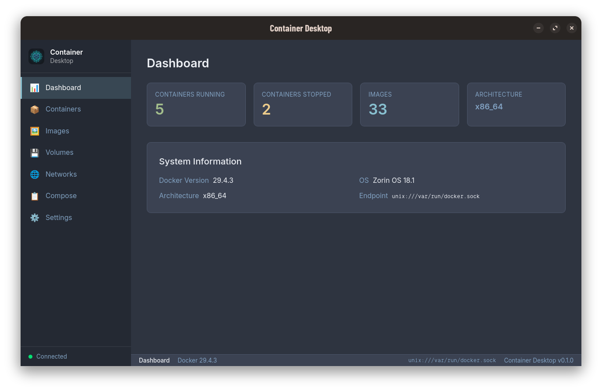

# Container Desktop

[](https://www.rust-lang.org)
[](https://tauri.app)
[](https://react.dev)
[](https://tailwindcss.com)
[](LICENSE)

A cross-platform desktop application for managing Docker containers, images, volumes, networks, and compose stacks — built with **Tauri v2** + **React / TypeScript / Tailwind CSS**.

> Inspired by Docker Desktop, Podman Desktop, and Rancher Desktop.



---

## AI Agent Bootstrap

Before any agent analyzes, answers questions about, plans changes for, or edits this repository, it must run:

```bash
./scripts/load-project-context.sh
```

That command is the canonical bootstrap entry point for project context. It enumerates `.deepseek/skills/`, verifies every `SKILL.md`, and prints the skill files so the active agent can load them before doing any repository work.

For automation or CI checks, use:

```bash
./scripts/load-project-context.sh --check
```

If the bootstrap fails, the agent should stop and surface the failure instead of continuing with partial context.

---

## Features

### Docker Resource Management

| Resource | Actions |
|---|---|
| **Containers** | List, start, stop, restart, remove. Log viewer with tail/since/until filters. Interactive terminal (sh, bash, zsh, ash, dash) with root option and single-command mode. Resource stats (CPU, memory, network, block I/O, PIDs). |
| **Images** | List, pull (with live progress), remove, tag, inspect |
| **Security** | Detect Grype / Trivy / Docker Scout, run background image scans, persist findings per image, and show consolidated vulnerability summaries without double-counting across tools |
| **Volumes** | List, create, remove, inspect |
| **Networks** | List, create (bridge/overlay/host/none), remove, inspect |
| **Docker Compose** | Up, down, streaming log viewer |

### User Interface

- Modern web-based UI rendered in a native WebView
- **Bilingual UI** with Auto / English / Spanish language selection
- **22 distinct themes** with unique color palettes: Catppuccin, Tokyo Night, Dracula, Nord, Gruvbox, Solarized, Kanagawa, Moonfly, Nightfly, Oxocarbon, Ferra
- Auto mode follows OS `prefers-color-scheme`; manual override with instant preview
- **Sortable data tables** — click any column header to sort ascending/descending
- **Font size presets**: Normal / Large / Larger (proportional scaling across all UI)
- **Monospace font selector** — uses platform-specific font enumeration (`fc-list` on Linux, `system_profiler` on macOS, curated defaults on Windows)
- Navigation sidebar with PNG icon (adapts to theme) and connection status indicator
- Bottom status bar with active screen, Docker version, endpoint, and the app version resolved from runtime/build metadata
- Minimal **Acerca de** link in the sidebar footer for project and licensing details
- Modal dialogs for image pull and confirmation actions
- Live streaming output for image pulls, container logs, compose, and terminal sessions

### Cross-Platform

- **Linux**: Unix socket (`/var/run/docker.sock`)
- **macOS**: Unix socket  
- **Windows**: Named pipe + TCP

### Connection Options

- Local Docker daemon (auto-detect on startup)
- Docker over plain TCP on localhost or a trusted local network (for example `tcp://localhost:2375` or `tcp://192.168.0.25:2375`)
- The Settings screen warns before saving a non-loopback `tcp://` endpoint and recommends SSH port forwarding for better security
- TLS-secured remote connections are not implemented yet

### Security Scanning

- Detects **Grype**, **Trivy**, and **Docker Scout** at runtime and shows OS-specific install guidance when a scanner is missing
- Persists selected scanners in `settings.json` and restarts scheduling automatically on app startup
- Runs one sequential background worker per selected scanner
- Reuses stored reports across launches and automatically deletes and refreshes results older than 3 days
- Prioritizes images that have never been scanned before refreshing stale reports
- Uses unified deduplication so overview charts and dashboard counters do not double-count the same vulnerability reported by multiple tools

---

## Architecture

```
frontend/          ← React + TypeScript + Tailwind (SPA in WebView)
src-tauri/         ← Rust backend: Tauri commands → domain → infrastructure
crates/domain/     ← Entities, repository traits, domain errors
crates/infrastructure/ ← Docker API (bollard), config persistence
```

Dependency direction: `domain ← infrastructure ← src-tauri`

| Layer | Tech | Purpose |
|-------|------|---------|
| Frontend | React 19, Tailwind CSS 4 | Desktop UI rendered in WebView |
| IPC Bridge | Tauri v2 commands (42 commands) | Type-safe Rust ↔ JS communication |
| Domain | Pure Rust | Entities, traits, no framework deps |
| Infrastructure | Bollard 0.21, directories | Docker API, config persistence |

---

## Prerequisites

- **Node.js** 24 LTS and **npm**
- **Rust** 1.88+ ([rustup.rs](https://rustup.rs))
- **Tauri CLI** (`cargo install tauri-cli --locked`)
- **Docker Engine** running locally (or a remote daemon)
- **Docker Compose v2** via `docker compose` (required for Compose features)

### System Dependencies (Linux)

```bash
sudo apt install -y \
  pkg-config \
  libglib2.0-dev \
  libwebkit2gtk-4.1-dev \
  libsoup-3.0-dev \
  libjavascriptcoregtk-4.1-dev \
  libgtk-3-dev \
  libayatana-appindicator3-dev \
  librsvg2-dev
```

**macOS / Windows**: No additional system dependencies required.

---

## Quick Start

### 1. Install frontend dependencies

```bash
cd frontend
npm install
cd ..
```

### 2. Install the Tauri CLI

```bash
cargo install tauri-cli --locked
```

### 3. Run in development mode

```bash
cargo tauri dev
```

Starts the Vite dev server (hot-reload on port 5173) and opens the Tauri window.

### 4. Build for production

```bash
cargo tauri build
```

Outputs:

- Binary: `target/release/container-desktop-app`
- Bundles: `target/release/bundle/`

---

## Packaging on Linux

To generate the Linux binary plus the `.deb`, `.rpm`, and `.AppImage` packages in one pass:

```bash
sudo apt install -y \
  pkg-config \
  libglib2.0-dev \
  libwebkit2gtk-4.1-dev \
  libsoup-3.0-dev \
  libjavascriptcoregtk-4.1-dev \
  libgtk-3-dev \
  libayatana-appindicator3-dev \
  librsvg2-dev

cd frontend && npm install && cd ..
cargo install tauri-cli --locked
cargo tauri build --bundles deb,rpm,appimage
```

Generated artifacts:

- Binary: `target/release/container-desktop-app`
- DEB: `target/release/bundle/deb/`
- RPM: `target/release/bundle/rpm/`
- AppImage: `target/release/bundle/appimage/`

If you update the source icon under `assets/icons/dark/icon16x16.png`, regenerate the Tauri bundle icons before building:

```bash
cargo tauri icon assets/icons/dark/icon16x16.png
```

The current Linux package requirements above include the extra dependencies discovered during packaging: `libayatana-appindicator3-dev` for tray/AppIndicator support and `librsvg2-dev` for the AppImage `linuxdeploy` GTK plugin.

---

## GitHub Actions

`.github/workflows/rust.yml` validates the project on pull requests to `main` and on pushes to `main`. It publishes Linux release assets only when a pull request from `dev` into `main` is merged and the validation job succeeds.

Published GitHub Release assets:

- `target/release/bundle/deb/*.deb`
- `target/release/bundle/rpm/*.rpm`
- `target/release/bundle/appimage/*.AppImage`
- `target/release/bundle/SHA512SUMS`

Each release uses the merge commit from `dev -> main` and gets a unique tag in the form `v<version>-<short-sha>`.

Users can validate the downloaded files with:

```bash
sha512sum -c SHA512SUMS
```

---

## Development

```bash
# Backend
cargo check
cargo check -p domain
cargo check -p container-desktop-app
cargo clippy
cargo fmt

# Frontend
cd frontend
npm run dev        # Dev server with HMR (port 5173)
npm run build      # Production build
npx tsc --noEmit   # Type check only
```

---

## Usage Guide

### Screens

| Screen | Description |
|---|---|
| **Dashboard** | Connection status, Docker daemon info (version, OS, container/image counts, architecture), and a consolidated security summary with totals, scanned images, images with findings, and vulnerability counts by severity |
| **Containers** | Sortable table with state badges. Select a container to access: **Logs** (tail N lines, since/until datetime filters, follow mode), **Terminal** (shell picker, root checkbox, interactive vs single-command), **Stats** (CPU%, memory, network RX/TX, block I/O, PIDs) |
| **Images** | Sortable table. Pull from registry with live progress stream. Remove with confirmation. |
| **Security** | Scanner availability and selection, unified severity chart, per-image scan status, and a modal drill-down with stored findings ordered by severity |
| **Volumes** | Sortable table. Create / remove. |
| **Networks** | Sortable table. Create with driver selector (bridge/overlay/host/none). Remove. |
| **Docker Compose** | Compose file path input, `.yml` / `.yaml` file picker, up/down buttons, live output stream |
| **Settings** | Language (Auto/Spanish/English), Theme (Auto/Manual + 22 variants), Docker endpoint URL, remote connection help modal, Font Size (Normal/Large/Larger), Monospace Font (platform-specific detection) |
| **Acerca de** | Project summary, MIT license, tech stack, and vibe coding note with minimalist access from the sidebar footer |

The sidebar also includes a direct **Cleanup** action that opens the Docker prune confirmation flow and reports how much space was freed after execution.

When the active Docker endpoint is a non-loopback `tcp://` host, the **Security** screen is disabled from the sidebar.

### Theme Selection

1. Navigate to **Settings**
2. Toggle **Auto** (follows OS) or **Manual**
3. If Manual, pick a theme — changes apply instantly
4. Click **Save** to persist across restarts

Available themes: Light, Dark, Dracula, Nord, Solarized Light/Dark, Gruvbox Light/Dark, Catppuccin (Latte/Frappe/Macchiato/Mocha), Tokyo Night (Standard/Storm/Light), Kanagawa (Wave/Dragon/Lotus), Moonfly, Nightfly, Oxocarbon, Ferra.

### Font Size

Three proportional presets that scale the entire UI:

| Preset | Base px | Effect |
|---|---|---|
| **Normal** | 14 | Default |
| **Large** | 18 | ~30% larger |
| **Larger** | 22 | ~60% larger |

All text sizes use `rem` units — changing the root size scales everything proportionally while preserving layout aesthetics.

### Monospace Font

The dropdown uses platform-specific font discovery: `fc-list` on Linux, `system_profiler SPFontsDataType` on macOS, and a curated monospace list on Windows. The selection applies to code blocks, logs, terminal output, and table data. Falls back to system monospace if none are available.

---

## Configuration

Settings are persisted to:

| Platform | Path |
|---|---|
| Linux | `~/.config/container-desktop/ContainerDesktop/settings.json` |
| macOS | `~/Library/Application Support/com.container-desktop.ContainerDesktop/settings.json` |
| Windows | `C:\Users\<User>\AppData\Roaming\container-desktop\ContainerDesktop\config\settings.json` |

### Example `settings.json`

```json
{
  "theme_setting": { "Manual": "TokyoNight" },
  "language_setting": "Auto",
  "endpoint": {
    "host_url": "unix:///var/run/docker.sock",
    "tls_ca": null,
    "tls_cert": null,
    "tls_key": null,
    "timeout_secs": 30
  },
  "window_width": 1280,
  "window_height": 800,
  "font_family": "JetBrains Mono",
  "font_size": 14,
  "security": {
    "selected_tools": ["Grype", "Trivy"]
  }
}
```

Persisted security reports are stored separately from `settings.json` under a `security/results/` directory in the same application config root.

### Remote Docker via SSH tunnel

Container Desktop supports direct `tcp://` endpoints for trusted local networks, but SSH tunneling remains the recommended option when you want stronger transport security. To use a Docker daemon from another machine on your LAN through SSH, expose the remote Docker socket on the **remote loopback** and tunnel it back to your machine.

1. Install `socat` on the remote machine:

   ```bash
   # Ubuntu / Debian
   sudo apt update && sudo apt install -y socat
   ```

2. On the remote machine, bridge loopback TCP to the Docker socket:

   ```bash
   socat TCP-LISTEN:2375,bind=127.0.0.1,fork UNIX-CONNECT:/var/run/docker.sock
   ```

3. On your local machine, create the SSH tunnel:

   ```bash
   ssh -N -L 23750:127.0.0.1:2375 usuario@192.168.0.135
   ```

4. In **Settings**, use this endpoint:

   ```text
   tcp://127.0.0.1:23750
   ```

The Settings screen includes the same instructions in a built-in help modal next to the Docker endpoint field.

---

## Security Workflow

Container Desktop now includes a dedicated **Security** workflow for Docker image vulnerability visibility.

Implemented behavior:

1. The sidebar includes a **Security** screen with scanner status, a unified severity chart, and a per-image list.
2. **Grype**, **Trivy**, and **Docker Scout** are detected on the host and can be enabled individually when installed.
3. Each selected scanner gets its own background worker and scans images sequentially.
4. Results are persisted locally per image and per tool so they can be reopened later without rerunning every scan.
5. Startup summaries are rebuilt from current images plus fresh stored results, deduplicating overlapping findings across tools.
6. Stored results older than 3 days are treated as stale, their JSON files are deleted before rescanning to recycle disk usage, and they are automatically requeued with never-scanned images taking priority.
7. Docker Scout uses SARIF output from the CLI so development mode does not create stray files inside `src-tauri/`.

---

## Project Structure

```
container-desktop/
├── Cargo.toml                 # Virtual workspace
├── frontend/                  # React + TypeScript + Tailwind
│   ├── package.json
│   ├── vite.config.ts
│   ├── index.html
│   └── src/
│       ├── main.tsx           # React entry point
│       ├── App.tsx            # Layout, navigation, theme, font
│       ├── index.css          # Tailwind + 22 theme palettes
│       ├── lib/
│       │   ├── tauri.ts       # Tauri IPC bridge (42 commands + events)
│       │   └── types.ts       # TypeScript interfaces
│       ├── components/
│       │   ├── Sidebar.tsx    # Navigation sidebar + PNG icon
│       │   └── StatusBar.tsx  # Bottom status bar
│       └── screens/
│           ├── Dashboard.tsx
│           ├── Containers.tsx # Table + Logs/Terminal/Stats tabs
│           ├── Images.tsx
│           ├── Security.tsx
│           ├── Volumes.tsx
│           ├── Networks.tsx
│           ├── Compose.tsx
│           └── Settings.tsx
├── src-tauri/                 # Tauri application
│   ├── Cargo.toml
│   ├── tauri.conf.json
│   ├── capabilities/default.json
│   └── src/
│       ├── main.rs
│       ├── lib.rs             # App state, setup, command registration
│       └── commands/          # Tauri IPC handlers
│           ├── connection.rs
│           ├── containers.rs  # + exec_create, exec_start, exec_input, exec_resize
│           ├── images.rs
│           ├── security.rs
│           ├── volumes.rs
│           ├── networks.rs
│           ├── compose.rs
│           └── settings.rs    # + list_fonts
└── crates/
    ├── domain/src/            # Entities + repository traits
    └── infrastructure/src/    # Docker API (bollard) + config persistence + security scanning
```

---

## Technology Stack

| Technology | Purpose |
|---|---|
| [Tauri v2](https://tauri.app) | Desktop framework |
| [React 19](https://react.dev) | UI library |
| [TypeScript](https://www.typescriptlang.org) | Type-safe frontend |
| [Tailwind CSS 4](https://tailwindcss.com) | Utility-first CSS |
| [Vite](https://vite.dev) | Frontend build tool |
| [Bollard 0.21](https://github.com/fussybeaver/bollard) | Docker Engine API |
| [Tokio](https://tokio.rs) | Async runtime |
| [Serde](https://serde.rs) | Serialization |

---

## License

MIT — See [LICENSE](LICENSE) for details.
